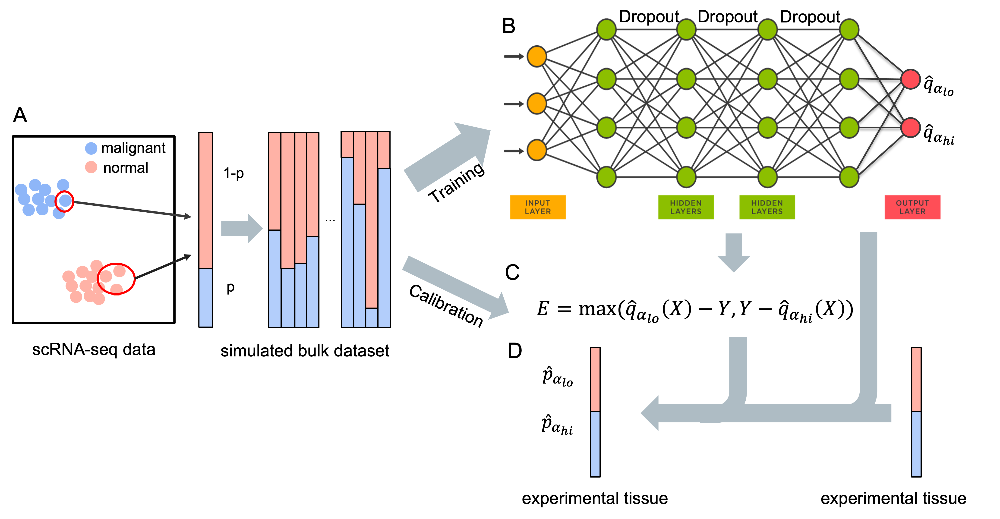

# DeepDeconUQ estimates cell fractions with valid prediction interval 

### Overview
Here, we introduce `DeepDeconUQ`, a neural network model designed to estimate the prediction interval of cell-type compositions in bulk RNA-seq data. This method addresses the limitations of current cell deconvolution techniques by providing uncertainty quantification for predictions of cancer cell fractions. `DeepDeconUQ` combines single-cell RNA sequencing (scRNA-seq) data and conformalized quantile regression to construct accurate prediction intervals. The model generates artificial bulk RNA-seq data with known malignant cell fractions, training a quantile regression neural network to predict upper and lower bounds for cancer cell proportions. A calibration step further adjusts these intervals, ensuring both validity (coverage probability) and discrimination (narrow intervals).

### Requirements
- torch                     2.2.2
- scikit-learn              0.24.2
- python                    3.11.6
- pandas                    2.2.1
- numpy                     1.26.4
- scanpy                    1.10.1
- anndata                   0.10.7         

### Installation
Download DeepDeconUQ by

```git
git clone https://github.com/jiaweih14/DeepDeconUQ.git
```
The installation has been tested in a Linux and Mac OS platform with Python3.11. GPU is recommended for accelerating the training process.

### Instructions
This section provides instructions on how to run DeepDecon with scRNA-seq datasets.
#### Data Preparation
Several scRNA-seq AML datasets have been prepared as the input of the DeepDeconUQ model. One can get the scRNA-seq AML data from Gene Expression Omnibus (GEO) under accession number GSE116256. We also provide a simulated dataset and relevent codes at zenodo [](https://doi.org/10.5281/zenodo.13999712)
.
#### Bulk sample simulation
DeepDeconUQ constructs bulk RNA-seq samples through the `get_bulk_samples.py` script. One can try to generate a bulk RNA-seq dataset with any ratio of malignant cell by running
```bash
python ./src/get_bulk_samples.py [-h] [--cells CELLS] [--samples SAMPLES] [--subject SUBJECT] [--start START] [--end END] [--binomial BINOMIAL] [--data DATA] [--out OUT]
-h, --help            show this help message and exit
--cells CELLS         Number of cells to use for each bulk sample.
--samples SAMPLES, -n SAMPLES
                      Total number of samples to create for each dataset.
--subject SUBJECT     Subject name
--start START         Fraction start range of generated samples e.g. 0 for [0, 100]
--end END             Fraction end range of generated samples e.g. 0 for [0, 100]
--binomial BINOMIAL   Whether generating bulk fractions from binomial distribution, 0=False, 1=True
--data DATA           Directory containg the datsets
--out OUT             Output directory
```
#### Model training
As long as we have the data, one can train DeepDecon models by running
```bash
usage: main.py [-h] [--seed SEED] [--tau TAU] [--suppress_plots SUPPRESS_PLOTS] [--dataset_name DATASET_NAME] [--num_q NUM_Q] [--gpu GPU] [--num_ep NUM_EP] [--hs HS] [--dropout DROPOUT]
               [--lr LR] [--wd WD] [--bs BS] [--wait WAIT] [--ds_type DS_TYPE] [--test_ratio TEST_RATIO] [--calibration_ratio CALIBRATION_RATIO]
               [--save_training_results SAVE_TRAINING_RESULTS] [--transform TRANSFORM] [--ct CT] [--out_dir OUT_DIR] [--pca PCA] [--noise NOISE]
               [--softmax SOFTMAX] [--cali_factor CALI_FACTOR] [--scaler SCALER] [--test_dataset TEST_DATASET]

options:
  -h, --help            show this help message and exit
  --seed SEED           random seed
  --tau TAU             quantile level
  --suppress_plots SUPPRESS_PLOTS
                        1 to disable all plots, or 0 to allow plots
  --dataset_name DATASET_NAME
                        dataset to use
  --num_q NUM_Q         number of quantiles you want to sample each step
  --gpu GPU             gpu num to use
  --num_ep NUM_EP       number of epochs
  --hs HS               hidden dimensions
  --dropout DROPOUT     dropout ratio of the dropout level
  --lr LR               learning rate
  --wd WD               weight decay
  --bs BS               batch size
  --wait WAIT           how long to wait for lower validation loss
  --ds_type DS_TYPE     type of data set. real or synthetic. REAL for real. SYN for synthetic
  --test_ratio TEST_RATIO
                        ratio of test set size
  --calibration_ratio CALIBRATION_RATIO
                        ratio of calibration set size
  --save_training_results SAVE_TRAINING_RESULTS
                        1 for saving results during training, or 0 for not saving
  --transform TRANSFORM
  --ct CT               celltypes when applying onto aml or pbmc data

  --out_dir OUT_DIR     model and prediction output directory
  --pca PCA             perform pca on the data (1) or not (0)
  --noise NOISE         select noise data (1, 5, or 10)
  --softmax SOFTMAX     add softmax activation to the output layer (1) or not (0)
  --cali_factor CALI_FACTOR
                        calibration factor for the calibration
  --scaler SCALER       standard or minmax scaler
  --test_dataset TEST_DATASET
                        testing dataset name, None means no testing dataset, use test_ratio to split the data
```

### Tutorial
See `DeepDeconUQ_example.ipynb` for reproducing the experimental results in this paper.
### Contact
Feel free to open an issue on GitHub or contact [me](jiaweih@usc.edu) if you have any problem in running DeepDeconUQ.